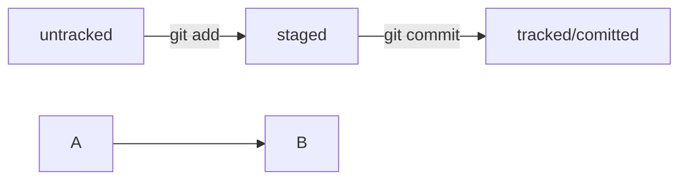

# Шпаргалка

## Полезные команды
pwd - полный путь где я щас  
ls - что внутри текущей диретории  
cd - переход куда то (. - текущая, .. - назад)  
cp - копирование кого - куда  
mv - перемещение кого - куда  
touch - создание файла  
mkdir - создание директории  
cat - содекржимое текстового файла  
rm\rm-dir\rm -rf - удаление файла\директории\директории и файлов(-r папку и содержимое, -f без вопросов "уверены?")  

## Создание репозитория
Внутри папки которую будем отслеживать
```
git init
```

## Проверка репозитория и лог
```
git status
```

```
git log
```

```
git log --oneline
```

## Добавление файлов для синхронизации
```
git add --all
```
или git add <имя файла>


## Коммит
```
git commit -m "Описание изменения"
```

## Привязка удаленниого репозитория к локальному (делается только один раз)
```
git remote add origin <ssh ссылка на репозиторий>
```

## Синхронизация репозитория
Так подробно только в первый раз
```
git push - u origin master
```
master или main

```
git push
```

## Статусы
modified - файл изменен  
tracked - Git следит / untraked - не следит  
staged - после git add



## Хэш
Внутри .git есть HEAD указывающий на хеш самого последнего коммита

## Подсказки по оформлению README.md
[Шпаргалка по Markdown](https://gist.github.com/fomvasss/8dd8cd7f88c67a4e3727f9d39224a84c)

``` C
//Пример кода на С
#import <test.cpp>

int a = 12;
```

## Дополнить последний коммит новыми или измененными файлами или изменить текст коммита
```
git commit --amend --no-edit
```
```
git commit --amend -m "Изменение сообщения"
```