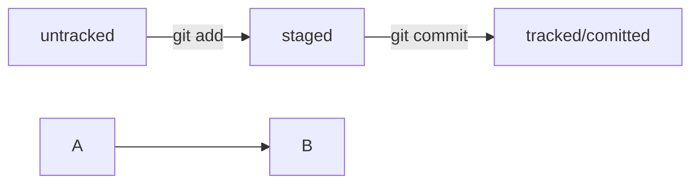

# Шпаргалка

## Полезные команды
pwd - полный путь где я щас  
ls - что внутри текущей диретории  (-a скрытые файлы)
cd - переход куда то (. - текущая, .. - назад)  
cp - копирование кого - куда  
mv - перемещение кого - куда  
touch - создание файла  
mkdir - создание директории  
cat - содекржимое текстового файла  
rm\rm-dir\rm -rf - удаление файла\директории\директории и файлов(-r папку и содержимое, -f без вопросов "уверены?")  
echo "текст" >> file.txt - запись текста в файл  

## Создание репозитория
Внутри папки которую будем отслеживать
```
git init
```

## Проверка репозитория и лог
```
git status
```

```
git log
```

```
git log --oneline
```

## Добавление файлов для синхронизации
```
git add --all
```
или git add <имя файла>  
Еси возникает ошибка CRCL
```
git config --global core.autocrlf false
```

## Коммит
```
git commit -m "Описание изменения"
```

## Привязка удаленниого репозитория к локальному (делается только один раз)
```
git remote add origin <ssh ссылка на репозиторий>
```

## Синхронизация репозитория
Так подробно только в первый раз
```
git push -u origin master
```
master или main

```
git push
```

## Статусы
modified - файл изменен  
tracked - Git следит / untraked - не следит  
staged - после git add



## Хэш
Внутри .git есть HEAD указывающий на хеш самого последнего коммита

## Подсказки по оформлению README.md
[Шпаргалка по Markdown](https://gist.github.com/fomvasss/8dd8cd7f88c67a4e3727f9d39224a84c)

``` C
//Пример кода на С
#import <test.cpp>

int a = 12;
```

## Дополнить последний коммит новыми или измененными файлами или изменить текст коммита
```
git commit --amend --no-edit
```
```
git commit --amend -m "Изменение сообщения"
```

## Откат
До публикации удалить
```
git restore --staged <file>
```
До публикации уже модифицированный файл
```
git restore <file>
```
После публикации откатиться к коммиту по номеру хэша
```
git reset --hard <hash>
```

## Просмотр изменений
```
git diff
```

```
git diff <хэш1> <хэш2>
```

## Копрование репозитория на свой комп
```
git clone <ssh ссылка>
```

## Ветки
Просмотр веток проекта
```
git branch
```
Создание ветки (-d и переход на нее)
```
git branch <название_ветки>
```
Переход на ветку
```
git checkout <название_ветки>
```
Слияние веток
```
git merge <название_ветки>
```
Удаление ветки
```
git branch -D <название_ветки>
```

## Подтянуть изменения из удаленного репозитория
```
git pull
```

## Отправка своей, изменной локально, ветки в удаленный репозиторий
```
git checkout main # перешли в main
git pull # подтянули новые изменения в main
git checkout my-branch # вернулись в рабочую ветку my-branch
git merge main # влили main в новую ветку my-branch
git push -u origin my-branch # отправили ветку my-branch в удалённый репозиторий
```
